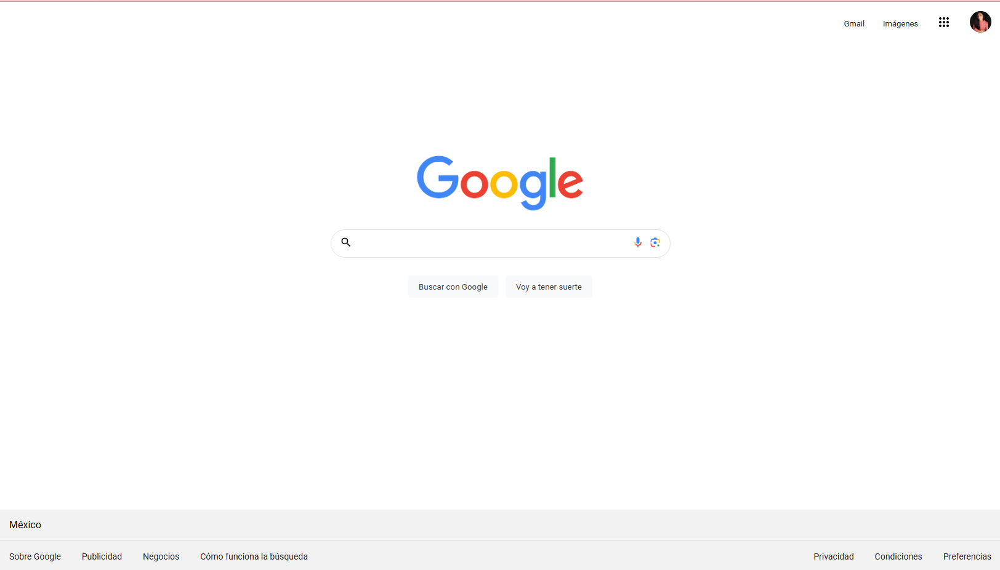

# Mi clon de Google realizado en TENCOLOCHICAS PRO

El presente proyecto es un clon de Google desarrollado para poner en práctica las habilidades obtenidas dentro del bootcamp de desarrollo frontend de Tecnolochicas PRO.

Fue desarrollado con HTML y CSS.

Proyecto desplegado https://clondegoogle-tecnolochicaspro.netlify.app

## Secciones de mi sitio

## Tecnologías

* HTML
* CSS
---
## Desarrollado por [Dariela](https://github.com/DarielaGZ) en Tecnolochicas PRO.